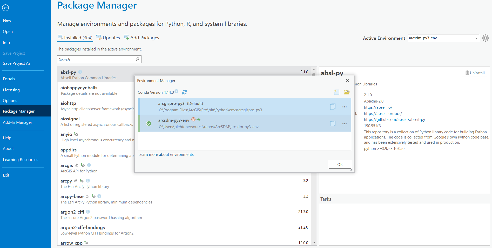
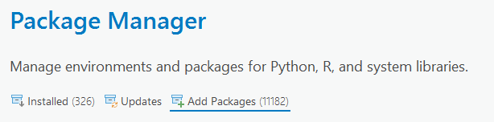

# ArcSDM

Spatial Data Modeler 6 for ArcGIS Pro 3.0+

---

## How to get started?

ArcSDM 6 is designed to work with ArcGIS Pro 3.0 and higher. The standard toolbox of ArcSDM 6 requires components that are compatible with ArcGIS Pro. Ensure you have ArcGIS Pro 3.0 or later installed to use ArcSDM 6 effectively.

If you want to work on your own data, you can download just the toolbox. If you want to try, evaluate and experiment with ArcSDM you can download our demodata separately from the main package.  

ArcSDM wiki contains a howtopage: https://github.com/gtkfi/ArcSDM/wiki/Howto-start

---

### Toolbox  
Click "Clone or download" and select the suitable download option for you. "Download Zip" is the safe and easy choice, just open the zip in a place where ArcGIS Pro has access in your computer and add the toolbox to ArcGIS Pro.  

---

### Compatibility
ArcSDM 6 is designed for:
- **ArcGIS Pro:** Version 3.0 or higher
- **Python Environment:** Python 3.9 or later (managed through ArcGIS Pro's Conda environment)

---

### Demodata  
Download the demodata as a zip package from our demodata git repository https://github.com/gtkfi/demodata. You can download the release file from here https://github.com/gtkfi/demodata/releases/download/v1.0/ArcSDM_Demodata.zip  
Open and save the zip optionally to your ArcSDM toolbox installation folder as "Data" folder. Then click "initworkdir.bat" to create (or overwrite older) working copy.  

---

## Usage of the ArcSDM Python env

At the moment is this advised to clone the ArcGIS Pro Python env and downloading the necessary packages to the cloned Python env.
Do not clone it to the default AppData folder. This might cause the required packages to not install.
Please clone the Python env to for example C:\user\path_to_a_folder\arcpy-py3-env

[How to use Python environments in ArcGIS Pro](https://pro.arcgis.com/en/pro-app/latest/arcpy/get-started/activate-an-environment.htm)

---

## Setting Up ArcSDM Python Environment

To use ArcSDM with ArcGIS Pro, follow these steps:

1. **Clone the Repository**:
    - Open ArcGIS Pro.
    - Navigate to `Project` -> `Package Manager`.
    - Clone the environment (not in the default location) to your local machine.

2. **Change ArcGIS Pro to Use ArcSDM Python Environment**:
    - Set ArcGIS Pro to use the `arcsdm-py3-env` environment.
    

3. **Restart ArcGIS Pro**:
    - Close and reopen ArcGIS Pro to apply the changes.
    - Add Packages Scikit-learn (1.30 <= x <= 1.5), Tensorflow and Imbalanced-learn by searching those libraries:
    
    - Sometimes packages do not install due to Proxy settings. Please retry, turn off your VPN or contact your organizations IT Help to enable the installation.

4. **Install Required Packages**:
    - Open the cloned Python environment in ArcGIS Pro.
    - Use the Package Manager to search for and install the following packages:
        - Scikit-learn (1.30 <= x <= 1.5)
        - TensorFlow
    - If you encounter issues due to proxy settings, retry the installation or contact your IT support for assistance.

By following these steps, you will have the necessary environment set up to use ArcSDM with ArcGIS Pro.

---

## Troubleshooting

### Issue: Missing Dependencies
If dependencies fail to install, verify that you are using the correct Python environment for ArcGIS Pro.

### Issue: Toolbox Not Showing
Ensure that the toolbox file (`ArcSDM.pyt`) is in a folder accessible to ArcGIS Pro and that it’s properly added to the project.

### Logs and Support
For error messages or unexpected behavior, check the ArcGIS Pro **Geoprocessing > History** pane for details.

---

## History:
16.10.2020 5.03-1 merging fuzzy membership files into fuzzy overlay files rewritten  
7.10.2020 5.03 fixes to calculateweights, calculateresponse, logisticregression and grandwofe 
14.8.2020 5.02.1 logisticregression works now on Pro 2.6 with file system workspace  
13.8.2020 5.02 arto-dev branch merged to master branch.  
23.7.2020 ArcSDM version 5.01.08 in the arto-dev branch. 
2.6.2020 arto-dev branch added. There are updated tool versions for testing. 
3.4.2020 New link to demodata and documentation how to run on Arcgis pro 2.5+ 
26.4.2018 5.01.01 Merged code by Tachyon-work to master-branch. 
6.10.2017 5.00.22 GrandWofe and various fixes 
2.10.2017 Updating wiki and this page, cleaning up.  
4.9.2017 5.00.22 Updates, fixes and new demodata 
17.5.2017 5.00.15 Updates and fixes  
5.5.2017 5.00.14 Calculate weights error with nodata fixed  
4.5.2017 5.00.13 Multiple fixes for minor UI errors  
10.4.2017 5.00.11 Quickfix 
24.2.2017 5.00.10 First release of experimental SOM toolbox. 
28.3.2017 Update to demodata path 
17.2.2017 5.00.07 Fixes  
2.2.2017 5.00.03 First draft version of Rescale raster -tool added 
29.12.2016 Area Frequency Table -tool added to toolbox and tmp toolbox removed 
14.12.2016 Separation of demodata and toolbox started. 
1.11.2016 Roc-tool included  
1.11.2016 Calculate response and Logistic regression feature complete and ready for testing, not clean 
27.9.2016 Calculate response update  
20.9.2016 Testing started against Arcgis desktop 10.4.1  
7.9.2016 Calculate response (WIP) + New demo data  
2.9.2016 Logistic regression (wip) Area frequency tool (wip) 
26.8.2016 Some new tools - Calculate weights done, needs work. 
8.8.2016  ArcGis desktop mxd, python toolbox - development branches  
26.5.2016 AddBearings, calculatebends and logistic regression tools. Demodatafixes updates 
28.4.2016 Logistic Regression tool (needs lots of work) 
18.4.2016 WofE manual steps compile 
13.4.2016 Demodata for tests added (from original files) 
1.4.2016 Repository created  
